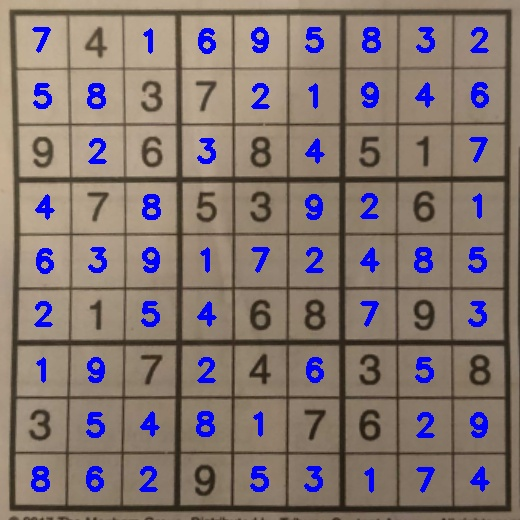
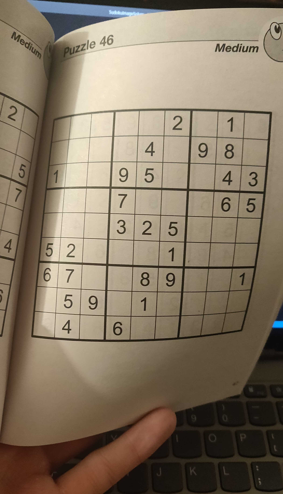
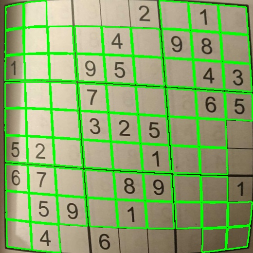
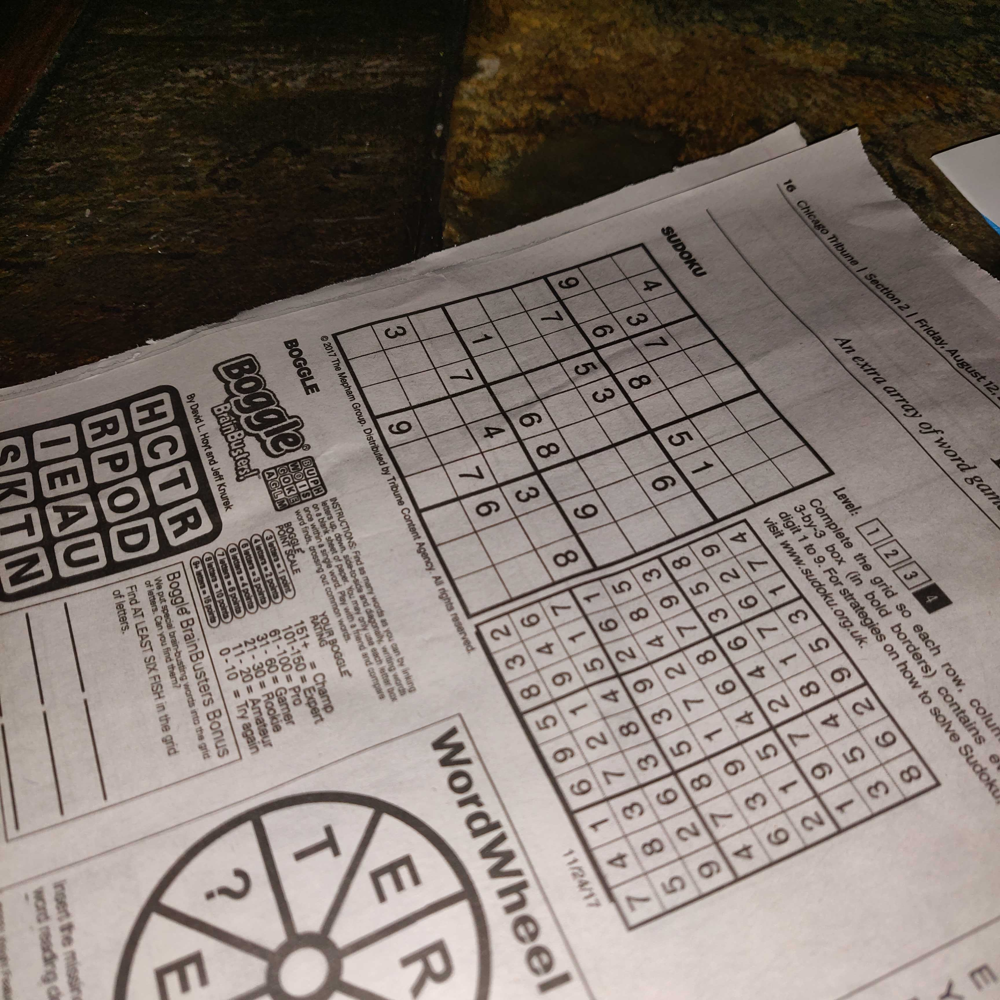
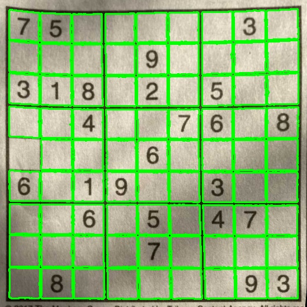
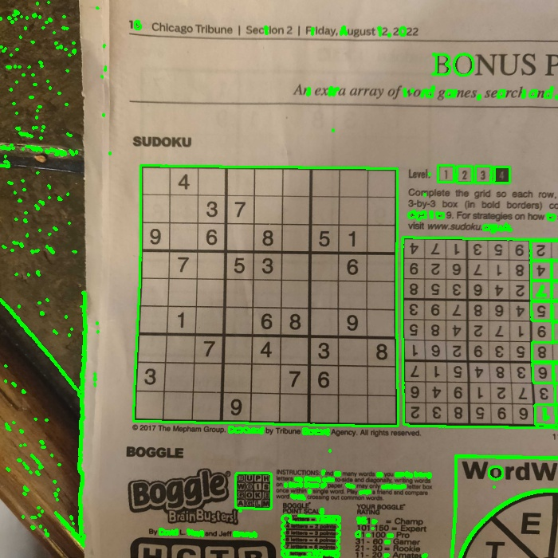
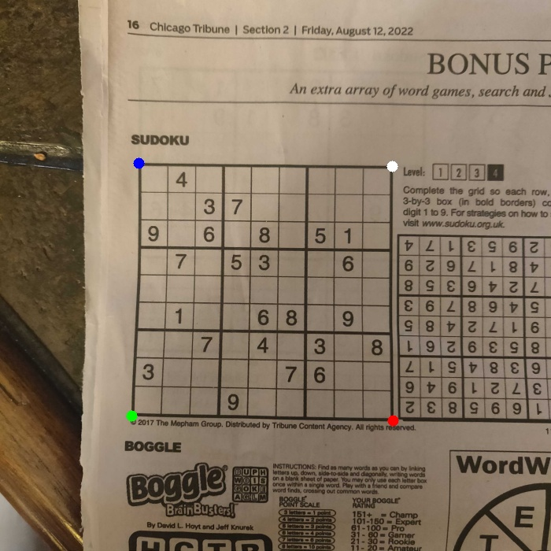
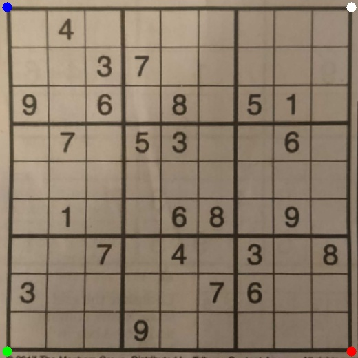
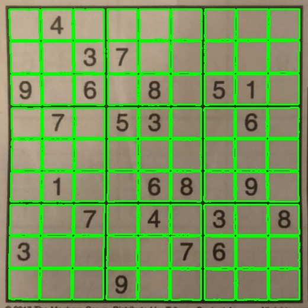
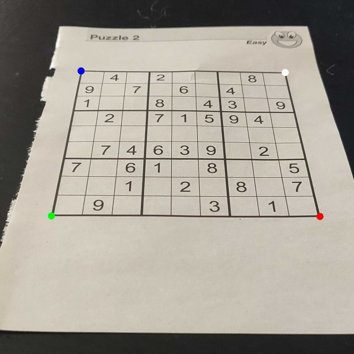

# Sudoku Image Solver
This project is about solving a sudoku puzzle contained in an image. The puzzle is identifed using fairly simple image processing techniques and heuristic rules, starting values are transcribed using a CNN, and solved with linear programming.
 

  
  

 

# Current Project Status
The Sudoku Image Solver is viable under generally favorable conditions. The puzzle in the image should be flat, with the picture taken from a reasonable angle. The project may see some updates in the future.
 
 

<!-- ## Example 1: Warped Puzzle
 

  
  

## Example 2: Extreme Angle
 

  
  

  -->

# To Run
The repository contains several images of sudoku puzzles and a digit recognition model to get started. Both are required parameters when running the script: 

`python sudokuimagesolver.py --image <name-of-image> --model digitnet`

The script looks for the image in `data/puzzles/` and the model in `models/` so any new images or models should be added to their respective directories.
 
 

# Methodology

## Identifying the Puzzle

A sudoku puzzle can be thought of as a case of nested quadrilaterals, with 81 square cells contained within a greater square that is the puzzle's outside edge. Contouring can be used to identify such shapes, and heuristic rules can help deduce which shapes belong to puzzle. 

The first phase of contouring intends to find the outer edge of the puzzle. Below, an approximation error of 5% is used for demonstration purposes. The script uses an error of 1% to reduce the number of puzzle edge candidates.

  
  

Each candidate then undergoes a perspective transform, providing a top-down view of the contoured object. After the perspective transform is complete, the image is contoured again with the intent of finding 81 quadrilateral contours. 

  
  
  

While the above example is fairly straight forward given the image was originally taken from a top-down view, the below example demonstrates the scripts ability to handle cases where the image is taken at an angle.

  
  

## Digit Recognition

## Solving the Puzzle