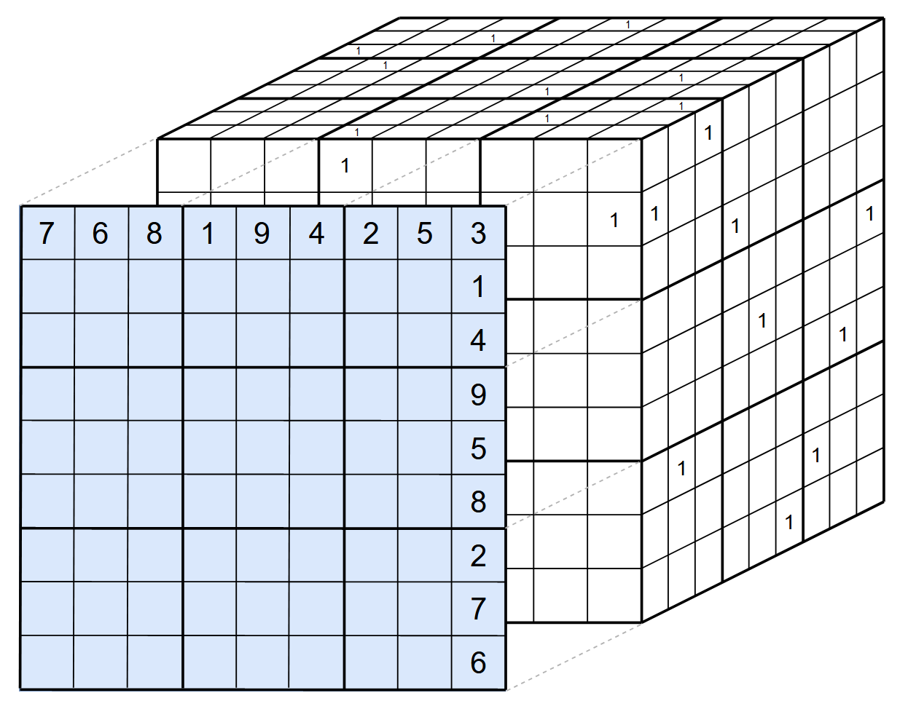

# Sudoku Image Solver
This project is about solving a sudoku puzzle contained in an image. The puzzle is identifed using fairly simple image processing techniques and heuristic rules, starting values are transcribed using a CNN, and solved with linear programming.
 

  
  

 

# Current Project Status
The Sudoku Image Solver is viable under generally favorable conditions. The puzzle in the image should be flat, with the picture taken from a reasonable angle. The project may see some updates in the future.
 
 

<!-- ## Example 1: Warped Puzzle
 

  
  

## Example 2: Extreme Angle
 

  
  

  -->

# To Run
The repository contains several images of sudoku puzzles and a digit recognition model to get started. Both are required parameters when running the script: 

`python sudokuimagesolver.py --image <name-of-image> --model digitnet`

The script looks for the image in `data/puzzles/` and the model in `models/` so any new images or models should be added to their respective directories.
 
 

# Methodology

## Identifying the Puzzle

A sudoku puzzle can be thought of as a case of nested quadrilaterals, with 81 square cells contained within a greater square that is the puzzle's outside edge. Contouring can be used to identify such shapes, and heuristic rules deduce which hierarchy of quadrilaterals represents the puzzle. 

The first phase of contouring intends to find the outer edge of the puzzle. Below, an approximation error of 5% is used for demonstration purposes. The script uses an error of 1% to reduce the number of puzzle edge candidates.

  
  

Each candidate then undergoes a perspective transform, providing a top-down view of the contoured object. After the perspective transform is complete, the image is contoured again with the intent of finding 81 quadrilateral contours (cells). If 81 cells are found, the puzzle is assumed discovered and digit recognition can be applied.

  
  
  

While perspect transform for the above example is fairly straight forward given the image was originally taken from a top-down view, the below example demonstrates the script's ability to handle cases where the image is taken at an angle.

  
  

 

## Digit Recognition

Digit recognition is done through a simple convolutional neural network. The data used to train the network is the Typeface MNIST dataset, with augmentations. Namely, the 0 class was replaced with blank cells with and without noise.

 

## Solving the Puzzle

A sudoku puzzle can be treated as an optimization problem and solved through integer programming. As such, the decision variables, constraints, and the objective function must be defined.

In this formulation, there are 729 binary (0 or 1) decision variables. These variables essentially form a cube: a 9x9 grid, 9 layers deep. The first two dimensions represent the rows and columns of the sudoku grid, while the layers represent the values a cell can take on. In particular, for a given cell, the index of the layer that contains a 1 corresponds to the value in the cell. For example, if a cell in a sudoku grid takes on a value of 3, this would be represented by a 1 in the third layer, with every other layer takes on 0. 

 

  

 

Now that the decision variables are defined, we have to define the constraints. They are as follows:
1. Each row must contain values 1-9, without repitition
2. Each column must contain values of 1-9, without repition
3. Each of the 9 non-overlapping 3x3 grids must contain values of 1-9, without repition
4. Each cell can only have one number
5. Starting values cannot change

Constriants 1-3 should be familiar to anyone who has taken on the task of solving a sudoku puzzle. Constraints 4 and 5 are required given our decision variables. The constraints in a mathematical format are as follow:

> Each row must contain values 1-9, without repitition

$$
\sum_{j=1}^9 v_{ijk} = 1 \quad \forall \; i, k
$$