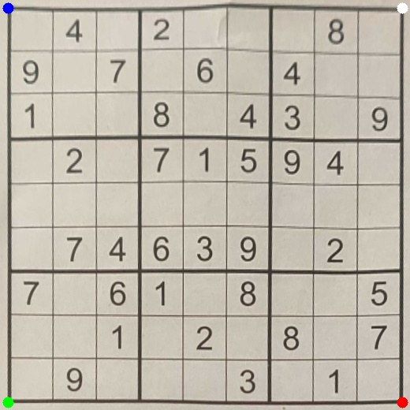

# Sudoku Image Solver
This project is about solving a sudoku puzzle contained in an image. The puzzle is identifed using fairly simple image processing techniques and heuristic rules, a CNN is used to identify the digits contained within the cells, and a linear programming approach is taken to solve the puzzle.

 

  
  

 

# Current Project Status
The Sudoku Image Solver is viable under generally favorable conditions. The puzzle in the image should be flat, with the picture taken from a reasonable angle. Improvements can still be made to the image processing (especially thresholding), and the digit classifier.
 
 

# To Run
The repository contains several images of sudoku puzzles and a digit recognition model to get started. Both are required parameters when running the script: 

`python sudokuimagesolver.py --image <name-of-image> --model digitnet`

The script looks for the image in `data/puzzles/` and the model in `models/` so any new images or models should be added to their respective directories.
 
 

# Methodology

## Identifying the Puzzle

A sudoku puzzle can be thought of as a case of nested quadrilaterals, with 81 square cells contained within a greater square that is the puzzle's outside edge. Contouring can be used to identify such shapes, and heuristic rules deduce which hierarchy of quadrilaterals represents the puzzle. 

The first phase of contouring intends to find the outer edge of the puzzle. Below, an approximation error of 5% is used for demonstration purposes, however, the script uses an error of 1% to reduce the number of puzzle edge candidates.

 

  
  

 

Each candidate undergoes a perspective transform, providing a top-down view of the contoured object. After the perspective transform is complete, the image is contoured again with the intent of finding 81 quadrilateral contours (cells). If 81 cells are found, the puzzle is assumed discovered and digit recognition can be applied.

 

  
  
  

 

Given the image in the above example was originally taken from a top-down view, the perspective transform seems trivial. The below example demonstrates the script's ability to handle cases where the image is taken at an angle.

 

  
  

 

## Digit Recognition

Digit recognition is done through a simple convolutional neural network. The data used to train the network is the Typeface MNIST dataset, with augmentations. Namely, the 0 class was replaced with blank cells with and without noise.

 

## Solving the Puzzle

A sudoku puzzle can be treated as an optimization problem and solved through integer programming. As such, the decision variables, constraints, and the objective function must be defined.

In this formulation, there are 729 binary (0 or 1) decision variables. These variables form a cube: a 9x9 grid that's 9 layers deep. The first two dimensions are used to represent any particular sudoku cell, while the layers represent the values that a cell can take on. More precisely, the value in the cell is equal to the index of the layer that contains a 1. For example, if a cell contains a 3, then the third layer will contain a 1 and every other layer will contain a 0. 

 

  

 

There are five constrains. The first three correspond to the known rules of the puzzle, the last two are a consequence of our formulation. They are as follows:

1. Each row must contain values 1-9, without repitition
2. Each column must contain values of 1-9, without repitition
3. Each of the 9 non-overlapping 3x3 sub-grids must contain values of 1-9, without repitition
4. Each cell can only have one number
5. Starting values cannot change

The objective function is easy: there is none! This because there is there is no solution that is better than any other solution. 